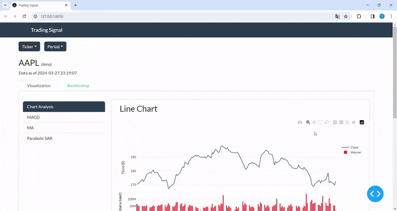

![License: CC0-1.0][license-shield]
![Last commit][last-commit-shield]
![Language][language-shield]

<!-- TABLE OF CONTENTS -->
## Table of Contents

* [Latest update](#latest-update)
* [About this repo](#about-this-repo)
* [Acknowledgements](#acknowledgements)
* [License](#license)

## Latest update
1. New indicator: Parabolic Stop & Reverse (PSAR) has been implemented. 
2. The backtest interface allows multiple strategies to be combined to predict the stock holdings.
3. The changes in the total amount of portfolio, cash and holding values are shown over time.  

## About this repo
This repo containes a Python Dash web application that provides visualization and backtesting functionalities to different algorithm trading for learning purposes. More technical indicators will be updated soon.

## Acknowledgements
* [Investopedia](https://www.investopedia.com/)
* [Algorithmic trading learning repo](https://github.com/awoo424/algotrading/)

## License
Licensed under the Creative Commons Zero v1.0 Universal.
[Copy of the license](https://github.com/Yung-Jer/trading-signal/blob/master/LICENSE).

<!-- MARKDOWN LINKS & IMAGES -->
[license-shield]: https://img.shields.io/github/license/Yung-Jer/trading-signal
[last-commit-shield]: https://img.shields.io/github/last-commit/Yung-Jer/trading-signal?color=blue
[language-shield]: https://img.shields.io/github/languages/top/Yung-Jer/trading-signal?color=purple

